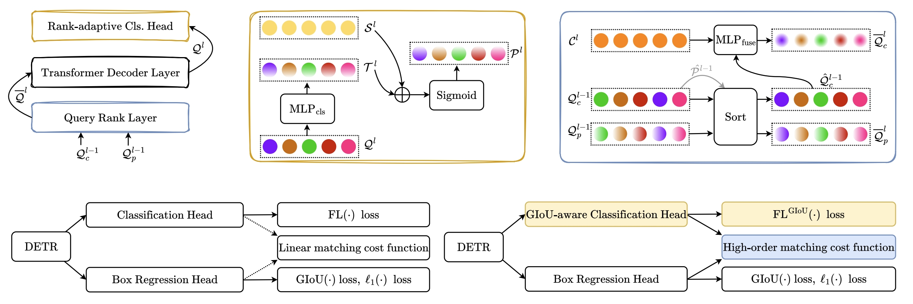

# Rank-DETR for High Quality Object Detection (NeurIPS 2023)

Yifan Pu, Weicong Liang, Yiduo Hao, Yuhui Yuan, Yukang Yang, Chao Zhang, Han Hu, and Gao Huang

[[`arXiv`](https://arxiv.org/abs/2207.13080)] [[`BibTeX`](#citing-rank-detr)]

<div align="center">
  
</div><br/>


## Table of Contents
- [Installation](#installation)
- [Pretrained Models](#pretrained-models)
- [Run](#run)
  - [Training](#training)
  - [Evaluation](#evaluation)
- [Citation](#citing-rank-detr)

## Installation
Please refer to the [installation document](https://detrex.readthedocs.io/en/latest/tutorials/Installation.html) of detrex.

## Pretrained Models
Here we provide the Rank-DETR model pretrained weights based on detrex:
<table><tbody>
<!-- START TABLE -->
<!-- TABLE HEADER -->
<th valign="bottom">Name</th>
<th valign="bottom">Backbone</th>
<th valign="bottom">Query Num</th>
<th valign="bottom">Epochs</th>
<th valign="bottom">AP</th>
<th valign="bottom">download</th>
<!-- TABLE BODY -->
</tr>
 <tr><td align="left"><a href="configs/rank_detr_r50_two_stage_12ep.py">Rank-DETR</a></td>
<td align="center">R50</td>
<td align="center">300</td>
<td align="center">12</td>
<td align="center">50.2</td>
<td align="center"><a href="https://cloud.tsinghua.edu.cn/f/4cc3dea3c2f64360894f/?dl=1">model</a></td>
</tr>
</tbody>
</tr>
 <tr><td align="left"><a href="configs/rank_detr_r50_two_stage_12ep.py">Rank-DETR</a></td>
<td align="center">R50</td>
<td align="center">300</td>
<td align="center">36</td>
<td align="center">51.2</td>
<td align="center"><a href="https://cloud.tsinghua.edu.cn/f/761f8e9e5bc74d2fa4ce/?dl=1">model</a></td>
</tr>
</tbody>
</tr>
 <tr><td align="left"><a href="configs/rank_detr_r50_two_stage_12ep.py">Rank-DETR</a></td>
<td align="center">Swin Tiny</td>
<td align="center">300</td>
<td align="center">12</td>
<td align="center">52.7</td>
<td align="center"><a href="https://cloud.tsinghua.edu.cn/f/b32aae34fce449aa9aca/?dl=1">model</a></td>
</tr>
</tbody>
</tr>
 <tr><td align="left"><a href="configs/rank_detr_r50_two_stage_12ep.py">Rank-DETR</a></td>
<td align="center">Swin Tiny</td>
<td align="center">300</td>
<td align="center">36</td>
<td align="center">54.7 </td>
<td align="center"><a href="https://cloud.tsinghua.edu.cn/f/649dc9b265a641f5be5c/?dl=1">model</a></td>
</tr>
</tbody>
</tr>
 <tr><td align="left"><a href="configs/rank_detr_r50_two_stage_12ep.py">Rank-DETR</a></td>
<td align="center">Swin Large</td>
<td align="center">300</td>
<td align="center">12</td>
<td align="center">57.3</td>
<td align="center"><a href="https://cloud.tsinghua.edu.cn/f/b03f2e1a148045e78619/?dl=1">model</a></td>
</tr>
</tbody>
</tr>
 <tr><td align="left"><a href="configs/rank_detr_r50_two_stage_12ep.py">Rank-DETR</a></td>
<td align="center">Swin Large</td>
<td align="center">300</td>
<td align="center">36</td>
<td align="center">58.2</td>
<td align="center"><a href="https://cloud.tsinghua.edu.cn/f/34912e493fb644dd8bf4/?dl=1">model</a></td>
</tr>
</tbody></table>


## Run
### Training

All configs can be trained with:

```bash
cd detrex
python projects/rank_detr/train_net.py --config-file projects/rank_detr/configs/path/to/config.py --num-gpus 8
```

* By default, we use 8 GPUs with total batch size as 16 for training.
* To train/eval a model with the swin transformer backbone, you need to download the backbone from the [offical repo](https://github.com/microsoft/Swin-Transformer#main-results-on-imagenet-with-pretrained-models) frist and specify argument `train.init_checkpoint` like [our configs](./configs/rank_detr_swin_tiny_two_stage_12ep.py).

### Evaluation
Model evaluation can be done as follows:
```bash
cd detrex
python projects/rank_detr/train_net.py --config-file projects/rank_detr/configs/path/to/config.py  --eval-only train.init_checkpoint=/path/to/model_checkpoint
```


## Citing Rank-DETR
If you find Rank-DETR useful in your research, please consider citing:

```bibtex
@inproceedings{pu2023rank,
  title={Rank-DETR for High Quality Object Detection},
  author={Pu, Yifan and Liang, Weicong and Hao, Yiduo and Yuan, Yuhui and Yang, Yukang and Zhang, Chao and Hu, Han and Huang, Gao},
  booktitle={NeurIPS},
  year={2023}
}
```